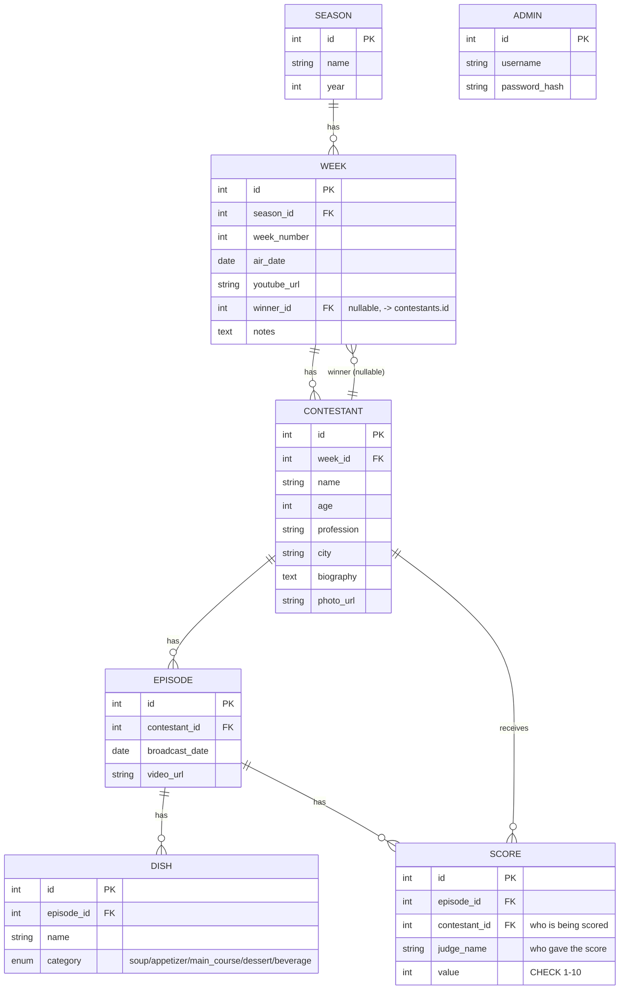

# Entity-Relationship Diagram

This reflects the actual SQLAlchemy models in `backend/app/models/`, verified via a
real Alembic migration (`migrations/versions/..._initial_schema...py`).

## Notes on modeling decisions

- **`Week.winner_id`** is a nullable self-referencing-style FK to `Contestant`
  (a contestant belongs to a week, but a week also points back to one contestant as
  the winner). This creates a circular dependency between the two tables, resolved
  with SQLAlchemy's `use_alter` + `post_update` so Alembic can create both tables
  without a chicken-and-egg problem.
- **`Score.judge_name`** is a plain string, not a FK to a `Judge` table. In this show
  the judges *are* the other contestants plus Zuhal — a separate `Judge` entity would
  just duplicate `Contestant` for no real benefit at this stage.
- **`Dish.category`** is a native DB enum (`DishCategory`), so invalid categories are
  rejected at the database level, not just in application code.
- **`Score.value`** has a `CHECK (value >= 1 AND value <= 10)` constraint — verified
  directly: an out-of-range score raises `IntegrityError` and is rejected before it
  can be committed.
- **`Admin`** wasn't in the original blueprint's entity list but is required for JWT
  login (Phase 3) — stores only a bcrypt/werkzeug password hash, never plaintext.
